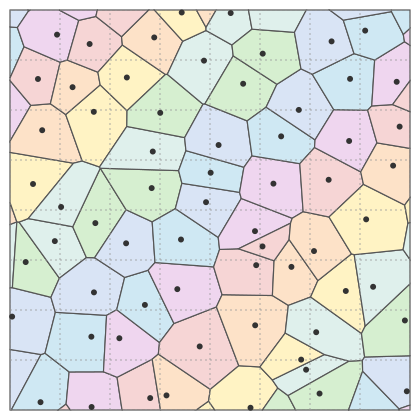
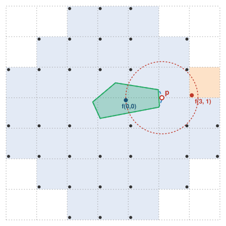

# Jittered Voronoi diagrams: which neighbourhood determines a cell?

A [jittered voronoi diagram](https://www.boristhebrave.com/docs/sylves/1/articles/grids/jitteredsquaregrid.html), also known as a [vectorizable random lattice](https://arxiv.org/abs/cond-mat/9305003) is a partition of the 2d plane into polygons via the following definition:

Define a **jitter** as a collection of distinct points (called **sites**), with exactly one placed in each square of a unit square grid `[a, a+1) × [b, b+1)`, `(a, b) ∈ ℤ²`. The **Voronoi cell** of a site is the set of points of the plane at least as close to it
as to every other site. The full jittered Voronoi diagram is the collection of Voronoi cells.



A jitter contains an infinite number of points, but only a finite set of of them are relevant to the calculation of a given Voronoi cell. This is useful in practise for efficient computation of the cells, as it means classic algorithms that work with a finite amount of sites may be re-used.

So the question is, what is the smallest neighborhood you need to use to guarantee that the finite case will result in the same cell as the infinite case. Without loss of generality, we consider the origin square only.

The answer is a `7 × 7` block around the origin with the three cells at each corner removed:

```
 .  .  X  X  X  .  .
 .  X  X  X  X  X  .
 X  X  X  X  X  X  X
 X  X  X  o  X  X  X
 X  X  X  X  X  X  X
 .  X  X  X  X  X  .
 .  .  X  X  X  .  .
```

This repo contains lean code that *proves* it.

Note: This is *not* the neighborhood you'd use for any pixel shader approaches, like [Worley noise](https://en.wikipedia.org/wiki/Worley_noise). Those only require evaluating the nearest 21 sites to the current pixel.

## Prior claims

* Lauritsen, Puhl and Tillemans, [*Performance of Random Lattice Algorithms*](https://arxiv.org/abs/cond-mat/9305003) (1993),
  state the same 36-cell neighbourhood ("Each point only can be connected to points in the 36-cell neighbourhood") and the
  matching bound √20 on the distance between connected sites, but give no proof.
* Martínez, Dumas and Lefebvre, [*Procedural Voronoi Foams for Additive Manufacturing*](https://hal.univ-lorraine.fr/hal-01393741v1),
  ACM Transactions on Graphics 35(4), SIGGRAPH 2016, claim (Figure 4) that with at least one seed per grid cell
  "the Voronoi cell of a seed cannot be influenced beyond a 2-ring of neighbors", i.e. that the `5 × 5` block suffices.
  The witnesses in this repo, for example the one for the cell `(3, 0)`, show that this is false: their argument
  proves that the cell stays inside the `5 × 5` block, but a site outside the block can still cut into it.
* Li, Hu, Chen, Kong and Huang, [*Explicit Topology Optimization of Conforming Voronoi Foams*](https://arxiv.org/abs/2308.04001)
  (2023; IEEE TVCG 2024), reuse the claim as an established fact ("the 2-ring criteria of Voronoi diagram tells that only
  seed points in a 2-ring around x₀ influence the density on x₀", citing the paper above) to evaluate their foams locally.
* The general bound for Delone sets, that the Voronoi cell is determined by the sites within twice the covering radius
  (Senechal, *Quasicrystals and Geometry*, 1995, Corollary 5.2), gives the full `7 × 7` block here.

## Statement

We define Voronoi cells in terms of points that are closed by squared euclidian distance. 
(see `voronoiDist_eq` which proves it doesn't matter if you square the distance or not).

```lean
/-- Squared Euclidean distance on `ℝ × ℝ`. -/
def sqDist (p q : ℝ × ℝ) : ℝ := (p.1 - q.1) ^ 2 + (p.2 - q.2) ^ 2

/-- A jitter is a function picking a site in every square in an infinite square grid (mem)
  with all sites sites distinct (injective)

  A typical jitter function would pe a pseudo-random choice that uses half-open intervals
  to guarantee injectivity (see `IsJitterIco.isJitter`)
 -/
structure IsJitter (f : ℤ × ℤ → ℝ × ℝ) : Prop where
  mem : ∀ c : ℤ × ℤ, (f c).1 ∈ Set.Icc (c.1 : ℝ) (c.1 + 1) ∧ (f c).2 ∈ Set.Icc (c.2 : ℝ) (c.2 + 1)
  injective : Function.Injective f

variable {ι : Type*}

/-- Returns the voronoi diagram for a set of sites f filtered to neighborhood N
  Returns empty set sites outside N.

  In other words `voronoiOn f N` gives a function that maps from squares listed in N to
  their corresponding Voronoi cell.

  Usuually ι will be the full square grid ℤ × ℤ, and  N will be the finite neighbourhood.
  --/
def voronoiOn (f : ι → ℝ × ℝ) (N : Set ι) (x : ι) : Set (ℝ × ℝ) :=
  {p | x ∈ N ∧ ∀ y ∈ N, sqDist p (f x) ≤ sqDist p (f y)}

/-- Returns the voronoi diagram for a set of sites, with no filter. -/
abbrev voronoi (f : ι → ℝ × ℝ) (x : ι) : Set (ℝ × ℝ) := voronoiOn f Set.univ x
```

Now we define what we're looking for

```lean
/-- A sufficient neighborhood is one where you always get the same Voronoi
cell for (0, 0) regardless of if you restricted to the neighborhood or not -/
def SufficientNbhd (N : Set (ℤ × ℤ)) : Prop :=
  ∀ f, IsJitter f → voronoiOn f N (0, 0) = voronoi f (0, 0)

/-- Here's our claimed answer --/
def Nbhd : Set (ℤ × ℤ) :=
  {c | c.1.natAbs ≤ 3 ∧ c.2.natAbs ≤ 3 ∧ c.1.natAbs + c.2.natAbs ≤ 4}

/-- Assert it is indeed sufficient, and minimal -/
theorem nbhd_isLeast : IsLeast {N | SufficientNbhd N} Nbhd
```

## Proof

*Sufficiency* (`Blocking.lean`). Fix the origin's site `(x₀, y₀)` and a test point `p = (u, v)`.
Say a cell *threatens* `p` if it contains a point strictly closer to `p` than `(x₀, y₀)`, and
*blocks* `p` if all its points are strictly closer. The key lemma `hasBlocker_of_threat` says
that if any cell outside `Nbhd` threatens `p`, some non-origin cell of `Nbhd` blocks `p`; so `p`
is already excluded from the local Voronoi cell.

* *Radius bound* (`sqDist_le_two_of_mem_voronoiOn_Nbhd`): a point `p` of the local Voronoi
  cell is within distance `√2` of `f(0,0)`. If `p` lies in `(-3/2, 5/2)²`, the square containing
  `p` is in `Nbhd` and its site is within `√2` of `p`; otherwise the column `x ∈ [2, 3]` in the
  row of `v` (or a mirror image) is entirely closer than `f(0,0)`, so `p` is not in the local
  cell at all (`far_right`).
* *Eight cells* (`hasBlocker_of_threat`): a threatening site is within `√2` of `p`, hence within
  `2√2` of the unit square, and outside `Nbhd` only the cells `(±3, ±2)`, `(±2, ±3)` come that
  close. By the symmetries of the square these reduce to the single cell `(3, 2)`
  (`block_three_two`), where the blocking cell is `(2, 1)`, `(1, 1)` or `(1, 2)` depending on
  where `p` is; each case is a corner-by-corner bound followed by (non)linear arithmetic.

Reflections `x ↦ 1 - x`, `y ↦ 1 - y` and `x ↔ y` are symmetries, and are used to reduce the cases.

*Necessity* (`Witness.lean`).
We simply supply seven "witnesses" which are a specific assignment of sites and a point to test, which
break if you don't include a specific cell in the neighborhood. The finitely many comparisons in the window 
`|a|, |b| ≤ 5` are checked by `decide +kernel` for all 36 cells; cells farther out are trivially far.

These witnesses are mirrored to cover all 36 cells.

Here's a diagram for the `(3, 1)` witness. Sites have been selected such that:
* The closest site to `p` is the `(3,1)` site
* The second closest site to `p` is the `(0,0)` site

The green polygon shows the Voronoi cell for the `(0, 0)` site computed with/without including the `(3,1)` site, it's clearly different in each case.



## Building

```
lake exe cache get   # Mathlib oleans
lake build
```
